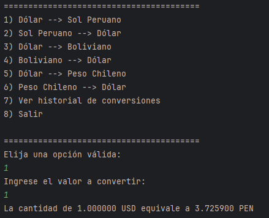
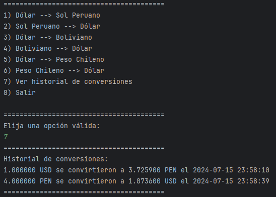

# Conversor de Divisas o Monedas

Este programa desarrollado en Java permite al usuario intercambiar monedas utilizando la API proporcionada por ExchangeRate-API.

## Características

### Inicio del Programa

Al correr la aplicación, se presenta un menú con diversas opciones para convertir entre monedas.

## Menú de Opciones

El menú despliega las siguientes alternativas:

1) Dólar --> Sol Peruano
2) Sol Peruano --> Dólar
3) Dólar --> Boliviano
4) Boliviano --> Dólar
5) Dólar --> Peso Chileno
6) Peso Chileno --> Dólar
7) Ver historial de conversiones
8) Salir

## Ejemplos

### Convertir de Dólar a Sol Peruano

### Convertir de Sol Peruano a Dólar

### Historial

## Proceso de Conversión

Luego de seleccionar una opción válida, se solicita al usuario ingresar el monto a convertir. Posteriormente, se efectúa la conversión utilizando la API y se muestra el resultado.

## Finalización del Programa

La opción 8) Salir permite cerrar la aplicación de manera controlada.

## Tecnologías Empleadas

- Java 17
- API de ExchangeRate-API
- Librería HttpClient para realizar peticiones HTTP
- Librería Gson para analizar respuestas JSON

## Requisitos

- JDK 17 o versión superior
- Conexión a Internet para acceder a la API de ExchangeRate-API

## Configuración de API

Antes de ejecutar el programa, asegúrese de configurar la variable API_KEY en ConversorMain.java con su propia clave de API de ExchangeRate-API.

## Historial de Conversiones

La aplicación también permite al usuario ver el historial de todas las conversiones realizadas, proporcionando una visión completa de sus actividades.

## Soporte para Más Monedas

La aplicación ha sido ampliada para soportar una lista más amplia de monedas, permitiendo a los usuarios convertir entre una variedad aún mayor de opciones monetarias.

## Registros con Marca de Tiempo

Los registros de conversión incluyen información sobre qué monedas se convirtieron y en qué momento, utilizando las funciones de la biblioteca java.time para crear registros que registren las conversiones realizadas.